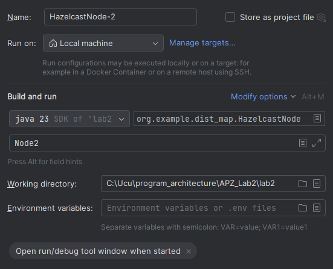
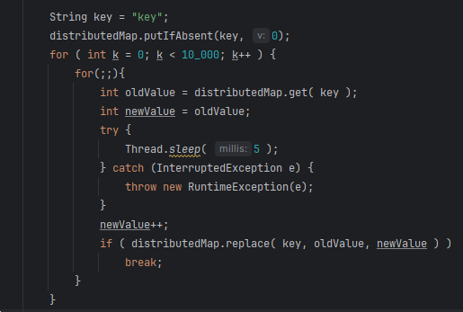

# Lab2 Hazelcast
### Ivaniuk Oleksandr

## 1. Distributed Map
I have such structure:  
  
It has done using argument of command line:  
  

### 1.1 Data saving
It is the result of writing 1000 numbers into map on 3 nodes.  
  
As we can see it is almost evenly distributed.  
  
Also this is safe terminating of nodes which resulting in saving data on other nodes.  

  

Here is the unsafe terminating which results in big data leaks.  

### 1.2 One element rewriting
It is the result of 3 clients incremented one element in map. Reult is not 30000.  

pessimistic locking (few seconds)  
works fine

Optimistic locking (2 minutes)  
This example is bad because all clients is changing one element, in most cases it works fine with distributed requests. But result is correct.

## 2. Bounded queue
I have enabled the bounded queue.  

The following is the result of 2 consumers reading the data from one producer.

  
We can see that consumers almost divided all data evenly.  
When consumers is not reading producer just stop writing to queue after 10 entries.

